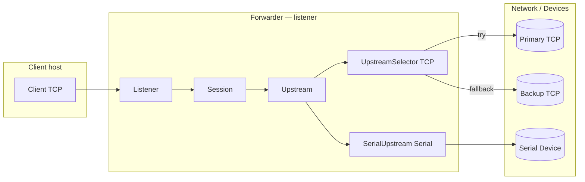
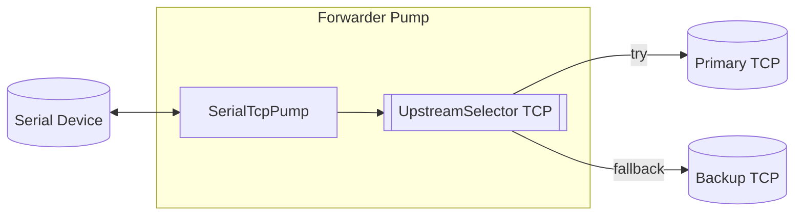
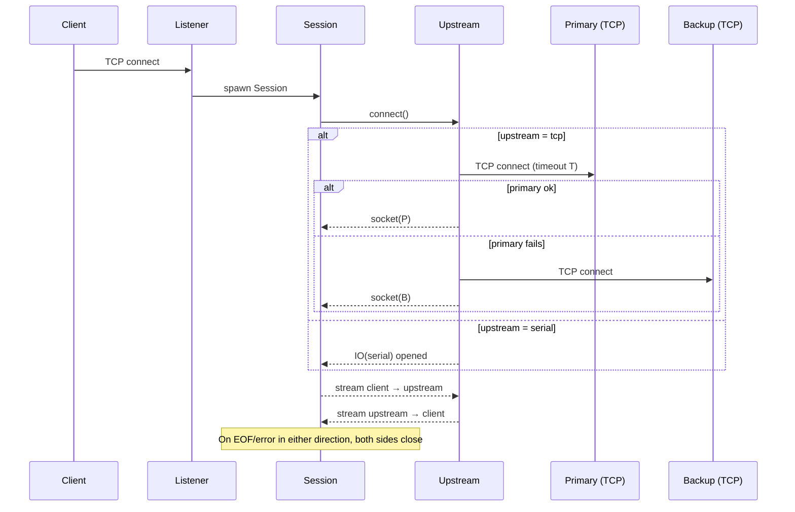
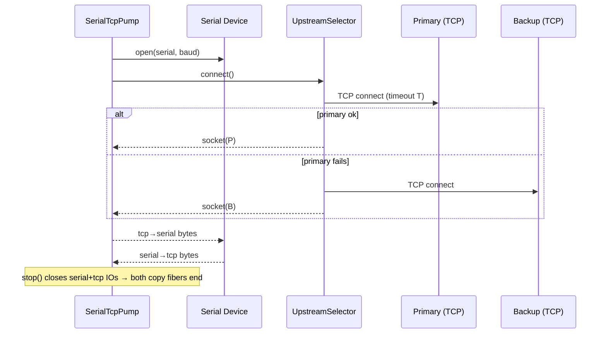

# Offgrid Forwarder - Architecture

## Components (Listener mode)

- Upstream is a small interface; at runtime we pick TCP failover (UpstreamSelector) or Serial (SerialUpstream) based on UPSTREAM_MODE.

## Components (Pump mode)

- Pump runs without a TCP listener. It opens the local serial device and connects to a remote TCP upstream (with primary→backup failover), then proxies bytes in both directions.

## Sequence — Listener mode (generic Upstream)

## Sequence — Pump mode (Serial ↔ TCP)

## Happy Path (Listener mode)

- Listener accepts client → spawns Session
- Session asks Upstream for a connection
- If TCP: UpstreamSelector tries primary, then backup
- If Serial: SerialUpstream opens the device (platform-specific init)
- Session proxies bytes both ways (two fibers)
- On EOF/error either side, both sides close

## Happy Path (Pump mode)

- Pump opens local serial device
- Pump connects to remote TCP upstream (primary → backup)
- Proxies bytes both ways until EOF/error
- stop() closes serial + tcp IOs, which breaks the copy fibers

## Config switches (quick reference)

- ROLE: `listener` (TCP listen) or `pump` (no listener; serial↔TCP)
- UPSTREAM_MODE: `tcp` or `serial` (listener mode only)
- SERIAL_DEV, SERIAL_BAUD: serial device path + baud (used by SerialUpstream and Pump)

_(Signal handling: in listener mode we stop accept and drain/force-close sessions; in pump mode we call pump.stop, which closes both IOs immediately.)_
