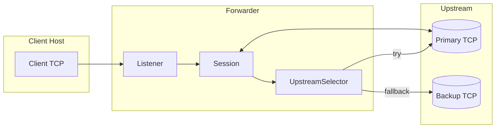
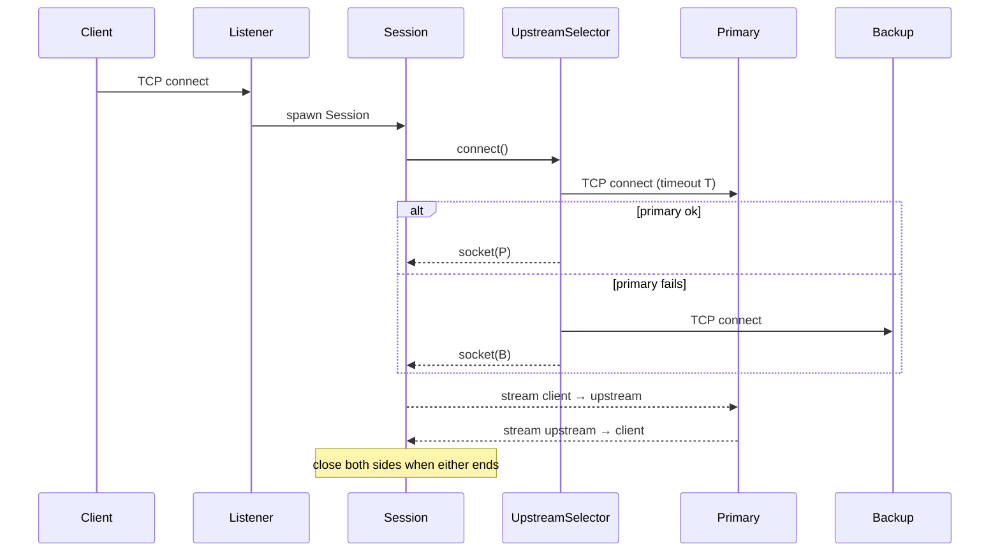

##  Happy Path

- Listener accepts client → spawns Session
- Session asks UpstreamSelector for connection
- UpstreamSelector tries primary, then backup
- Session proxies bytes both ways (two fibers)
- On EOF/error in either direction, both sockets close